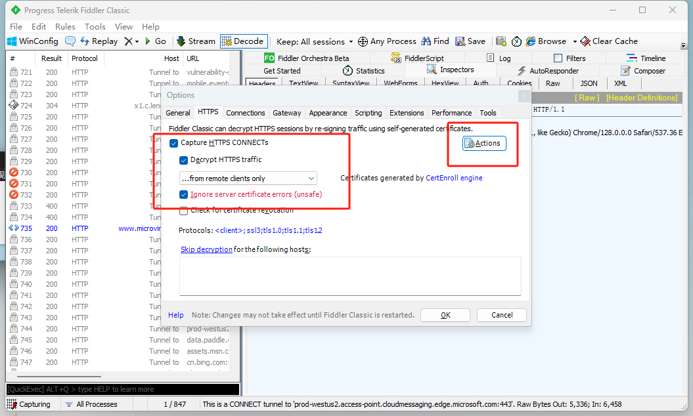
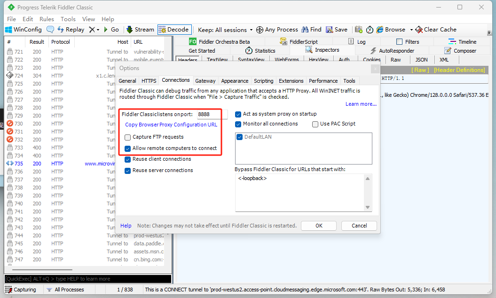
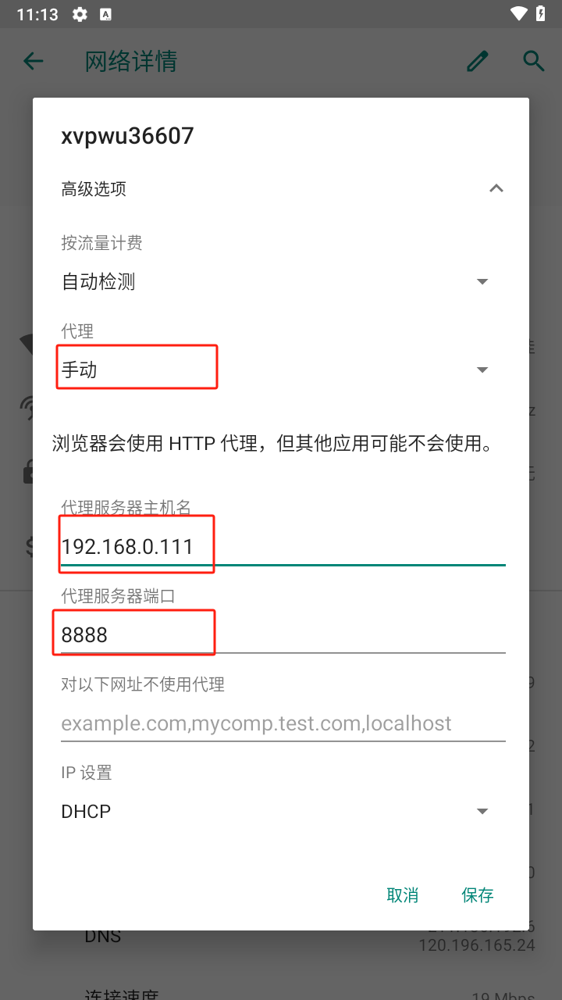
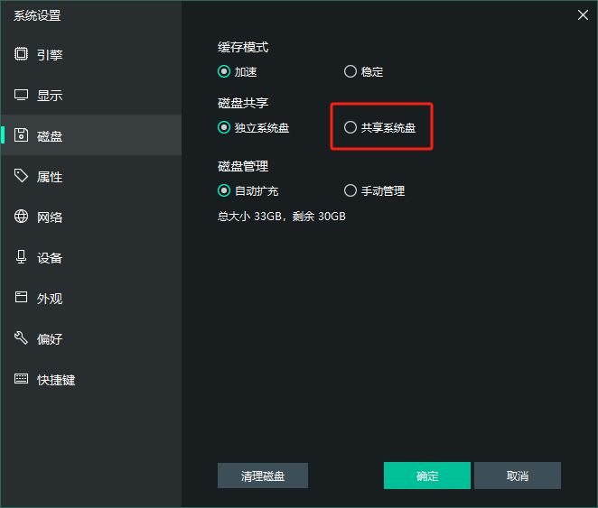

## 如何使用 `Fiddler`对`Android`  APP` 抓包 

#### `Fiddler` 设置

1. `Toos` -> `Options...` -> `HTTPS`，勾选`Capture HTTPS CONNECTs`以及`Decrypt HTTPS traffic`，如下图：

   

2. 点击 `Actions` -> `Trust Root Certificate`，按照提示操作；

3. 点击`Actions` -> `Export Root Certificat to Desktop`，会在桌面生成`FiddlerRoot.cer`;

4. `Toos` -> `Options...` -> `Connections`，勾选`Allow remote computers to connect`以及`Fiddler Classiclistens onport:`，如下图：

   

#### `Android` 设置

1. 设置网络，`设置`-> `网络`->`编辑`，设置代理为手动，以及代理地址和端口，注意，这里需要`Fiddler`和`Android`设备在同一网络环境下，如下图：

   

   代理服务器主机名：这里填你`Fiddler`所在主机上的局域网`IP`，具体可以在`windows`搜索栏输入`cmd`，回车，然后在命令行中输入`ifconfig`，即可获得；

   代理服务器端口：这里填上面第四步操作中`Fiddler Classiclistens onport`后面的配置；

#### 安装证书

1. 将`Fiddler`第三步中导出的`.cer`证书转换为`.pem`证书；

   ```shell
   openssl x509 -in FiddlerRoot.cer -inform DER -out {文件名}.pem -outform PEM
   ```

2. 获取证书的文件名；

   ```shell
   openssl x509 -subject_hash_old -in {文件名}.pem
   ```

   这里会得到这个结果`269953fb`

3. 生成最终的`Android` 中安装的证书`269953fb.0`；

   ```shell
   openssl x509 -in {文件名}.pem -inform PEM -out 269953fb.0
   ```

4. 将证书发送到`Android`设备上，安装到系统证书中，这里以逍遥模拟器为例，其他可做参考

   ```shell
   adb push 269953fb.0 /sdcard
   adb shell
   su
   mount -o remount,rw /system
   cp /sdcard/269953fb.0 /system/etc/security/cacerts
   chmod 644 /system/etc/security/cacerts/269953fb.0
   mount -o remount,ro /system
   ```

   这里有一点需要注意，`mount -o remount,rw /system` 出现类似`'/dev/block/sda6' is read-only`错误，大概率是因为创建逍遥模拟器的时候磁盘的设置默认是共享系统盘，这里只需要修改为独立系统盘即可，如下图：

   

#### 结束

至此，你就可以愉快的你想要的`App`上的包了。